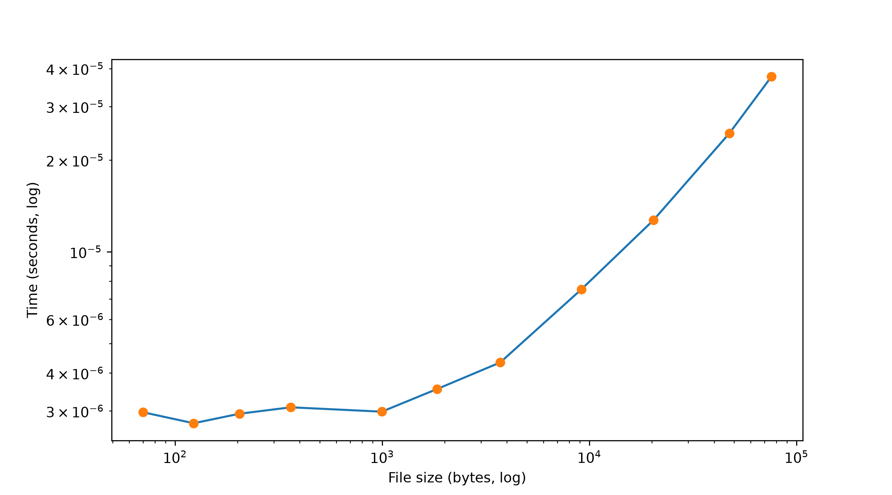
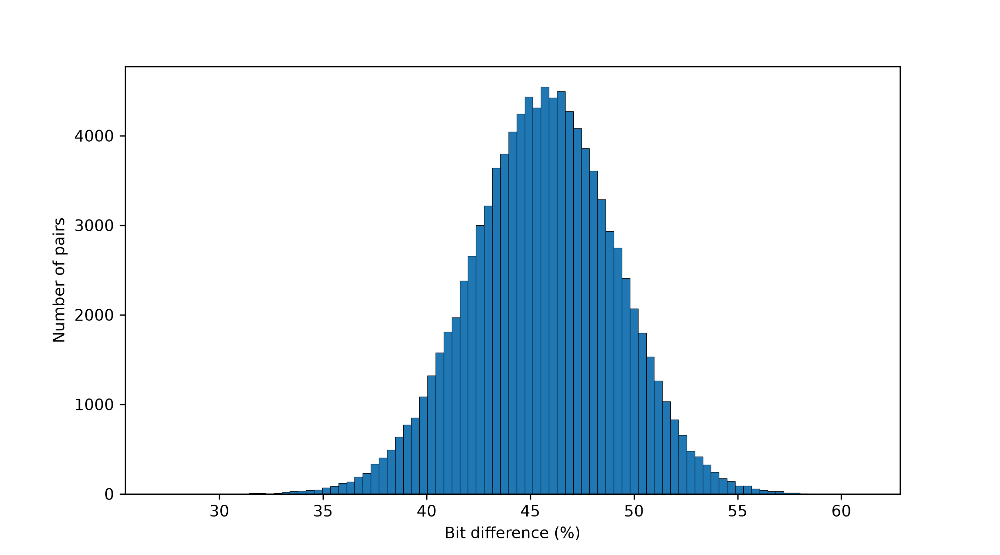
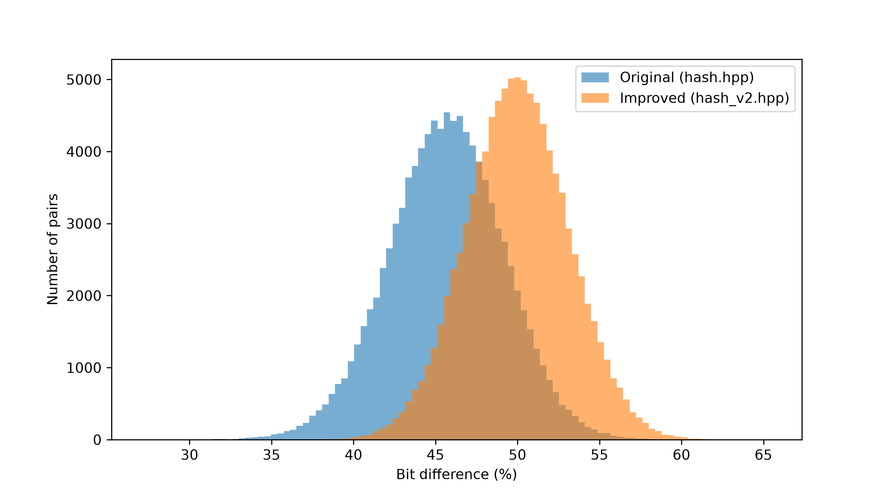
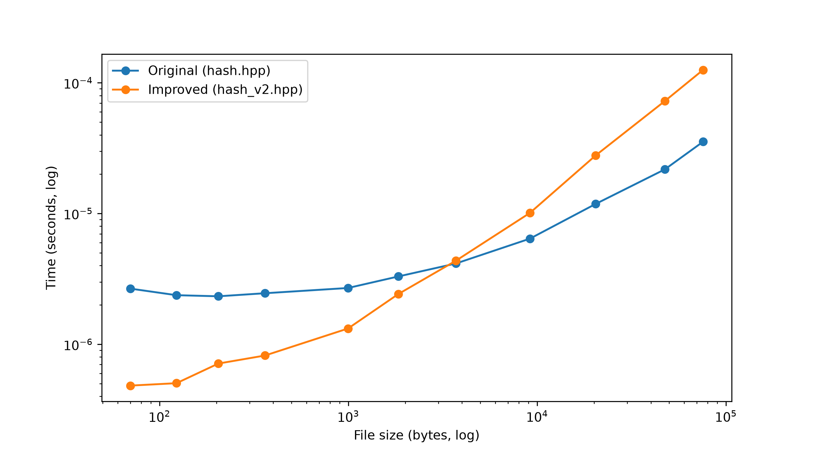
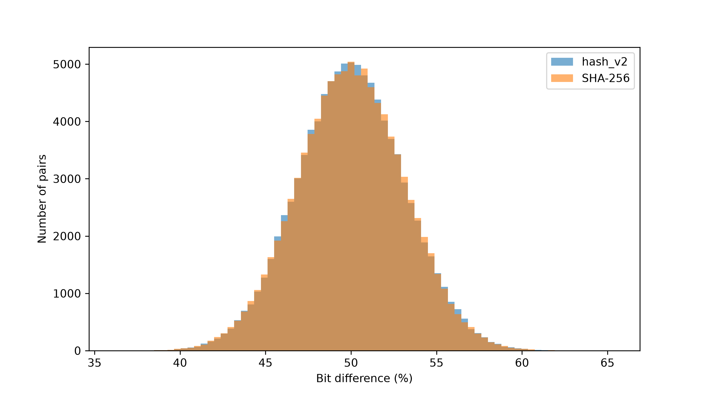
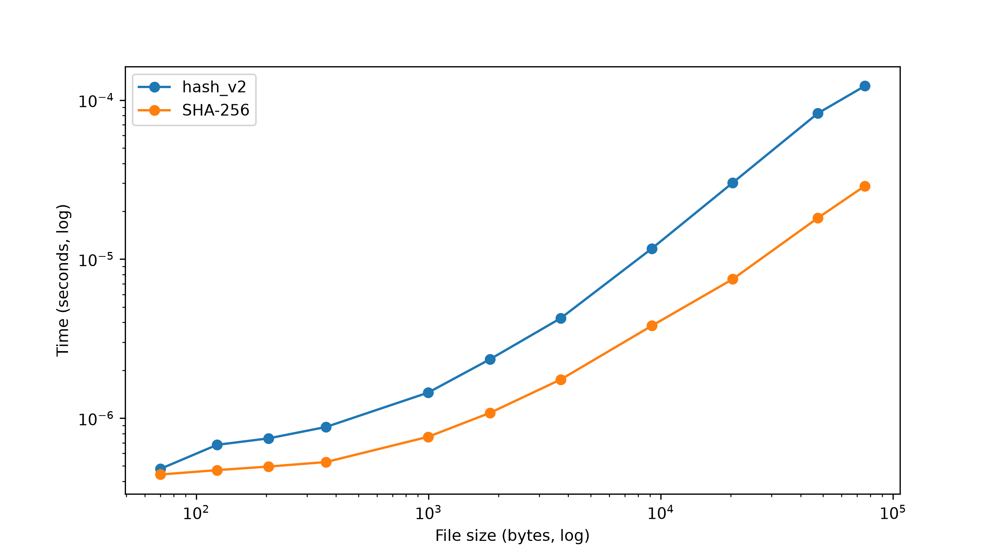

# Image-based hash function

## Description

This is a custom hash function that uses raw pixel data from an image to hash its input.

## How it works

A PNG image named [`image.png`](image.png) must be present in the directory the program is run from.

The hash function is implemented in [`hash.hpp`](hash.hpp).

### Input

Text or a filename (the file must have the `.txt` extension). Input is expected to contain only ASCII characters. Text typed in by hand has its newline character removed.

### Input limitations

Only the first 128 bytes of the input are used directly. Bytes after that only affect the hash through the offset from step 3 (`byte sum + 256 * input length`).

### Step-by-step process

1. The PNG file is read into memory as raw pixel data.
2. The input is converted into an `int` array (`char[] -> int[]`). If a salt is given (optional: 16 bytes written as 32 hex characters), it is decoded and its 16 bytes are appended to the array (`input || salt`).
3. The array is summed into a single `int` value, and the input length multiplied by 256 is added to it. The result is used to offset the X and Y coordinates of the pixel lookup in step 4.
4. The array is processed in groups of four elements, with each group split into two pairs (elements past the end of the array count as 0). Each pair `(a, b)` is combined as `a * 256 + b`. The offset is added to both results, along with the position of the output byte being produced (0–31) multiplied by 7 for X and by 13 for Y, so the same elements point to a different pixel at each output position instead of repeating one pixel. The results are used as the X and Y coordinates of a pixel in the image. If a coordinate exceeds the image resolution, it is wrapped using the modulo operation, and the quotient of the original coordinate divided by the image resolution is added to the result.
5. The pixel's RGB values are combined with bitwise XOR: `R ^ G ^ B`.
6. The result is converted to hexadecimal and appended to the hash string.
7. If the hash is shorter than 64 hex characters, the pixel lookup is run again, with the `int` array shifted by the current iteration count.
8. If the hash is longer than 64 hex characters, it is truncated to 64 characters.
9. The hash is returned.

### Running the hash function

From the `Project_1` directory:

```bash
make build
./cli_hasher
```

The command-line program is [`cli.cpp`](cli.cpp).

## 1 Eksperimentinis tyrimas: teisingumas ir sparta

All experiment files are in [`Experiment/exp1/`](Experiment/exp1).

To run the whole experiment (steps 1–5 below), use [`run_exp1.sh`](Experiment/exp1/run_exp1.sh):

```bash
./Experiment/exp1/run_exp1.sh
```

The script builds the executables, runs each step in order and prints where the results were saved. It stops if any step fails.

1. [`gen_files.py`](Experiment/exp1/gen_files.py) generates the following test files in `gen/`:
   - An empty file and 2 files containing a single character.
   - 3 files with random content, each larger than 1000 bytes.
   - Copies of those 3 random files with a single byte changed.
   - Several files with repeating characters, files with shuffled content, and files with and without spaces and newlines.
   - A file with non-ASCII characters.
2. [`test_files.py`](Experiment/exp1/test_files.py) tests the generated files. For every file, the script checks that the hash has the correct length and that hashing the content as text gives the same hash as hashing the file. The results are written to [`exp1_results.txt`](Experiment/exp1/exp1_results.txt).
3. [`gen_konst.py`](Experiment/exp1/gen_konst.py) generates `.txt` snippets of [`konstitucija.txt`](Experiment/exp1/konstitucija.txt) in `gen_konst/`.
4. [`bench_konst.cpp`](Experiment/exp1/bench_konst.cpp) benchmarks the hash function on each constitution snippet. An untimed warm-up run loads the image into the cache, then each snippet is hashed and timed 10 times. The results are written to `out_konst/bench_konst.csv` and show the filename, file size in bytes, and the average, minimum and maximum hashing time. To run it, use `make build` and then `./Experiment/exp1/bench_konst` from the `Project_1` directory.
5. [`graph.py`](Experiment/exp1/graph.py) generates a graph from `bench_konst.csv` to visualize the hash function's speed and saves it as [`out_konst/bench_graph.png`](Experiment/exp1/out_konst/bench_graph.png).



## 2 Eksperimentinis tyrimas: kolizijos ir lavinos efektas

All experiment files are in [`Experiment/exp2/`](Experiment/exp2).

To run the whole experiment (steps 1–9 below), use [`run_exp2.sh`](Experiment/exp2/run_exp2.sh):

```bash
./Experiment/exp2/run_exp2.sh
```

Steps 1–6 are done by [`collision_test.cpp`](Experiment/exp2/collision_test.cpp), steps 7–8 by [`avalanche_test.cpp`](Experiment/exp2/avalanche_test.cpp) and step 9 by [`avalanche_graph.py`](Experiment/exp2/avalanche_graph.py).

1. 100,000 pairs of random ASCII strings are generated for each length: 10, 100, 500 and 1000 (200,000 strings per length). The two strings in a pair always differ. Characters are taken from the 95 printable ASCII characters (`0x20`–`0x7E`, one byte each), using `std::mt19937_64` with seed `20261007 + length`.
2. The two hashes of every pair are compared, and the number of pairs with the same hash is counted for each length.
3. All 200,000 strings of one length are also checked against each other. Identical strings are counted once, and the distinct strings are grouped by hash in a hash map. Any group with more than one string is a collision. This gives the same result as comparing every string with every other one (about 2·10¹⁰ comparisons), but in a single pass.
4. Small structured input sets (permutations, rotations, byte swaps, repeated patterns, short strings, one-byte changes, trailing zero bytes, ...) look for weaknesses that random strings are unlikely to hit.
5. Results are written to [`exp2_results.txt`](Experiment/exp2/exp2_results.txt), with collision examples in `out/`. Random strings gave no collisions. The structured tests found collisions when bytes after position 128 are reordered (`tail_after_128`) and when single bytes are changed to the next character (`single_byte_change`).
6. For an ideal 256-bit hash, each pair collides with probability 2⁻²⁵⁶, so the expected number of collisions is about 8.6·10⁻⁷³ for the pair check and 1.7·10⁻⁶⁷ for the full set (m(m−1)/2 ≈ 2·10¹⁰ pairs).
7. 100,000 pairs are generated, 25,000 per length, with the same generator and seed as step 1. The two strings in a pair differ in exactly one randomly chosen character, and their hashes are compared by the percentage of differing bits (hex decoded to bytes first) and of differing hex digits.
8. The minimum, maximum and average of both measures, for each length and for all pairs together, are written to [`avalanche_results.txt`](Experiment/exp2/avalanche_results.txt). The values for each pair are saved in [`out/avalanche.csv`](Experiment/exp2/out/avalanche.csv). On average 45.63% of the bits and 88.66% of the hex digits change, a little below the reference values of 50% and 93.75% for independent, uniformly distributed outputs.
9. [`avalanche_graph.py`](Experiment/exp2/avalanche_graph.py) draws a histogram of the bit difference percentages from [`avalanche.csv`](Experiment/exp2/out/avalanche.csv) and saves it as [`out/avalanche_hist.png`](Experiment/exp2/out/avalanche_hist.png).



## 3 Eksperimentinis tyrimas: spėjimas ir išvados

All experiment files are in [`Experiment/exp3/`](Experiment/exp3).

To run the whole experiment (steps 1–4 below), use [`run_exp3.sh`](Experiment/exp3/run_exp3.sh). The results are written to [`exp3_results.txt`](Experiment/exp3/exp3_results.txt).

```bash
./Experiment/exp3/run_exp3.sh
```

1. The candidate set is all four-digit strings `0000`–`9999`. The target input `7164` is chosen randomly (`std::mt19937_64`, seed `20261007`). The attack ([`brute_force.cpp`](Experiment/exp3/brute_force.cpp)) receives only the candidate set and the target hash, and tries every candidate to find all matches.
2. **No salt:** the target was found after 7165 attempts (~22 ms), and it was the only match. A match does not necessarily identify the original input: a different candidate could have the same hash (a collision), so a match only shows that the candidate fits the hash.
3. **Public salt:** the salt is 16 random bytes, written as 32 hex characters and appended to the input as raw bytes. The attacker knows the salt, so one target takes the same effort as without salt: 7165 attempts (~20 ms). The salt only prevents reuse. Without salt, one table of all 10,000 hashes cracks every target by lookup. With salt, every target has its own salt and needs its own 10,000 hashes: 5 targets took 50,000 hashes (~134 ms) instead of 10,000 (~26 ms).
4. **Secret salt:** for `H(input || r)` with an unknown 128-bit `r`, the search space grows to `10000 * 2^128` combinations, which is not feasible to brute force. Once `r` is revealed, anyone can check that `H(input || r)` equals the published hash, and the 10,000 candidates can be brute forced again with that `r`.

## Improved hash function

### Description

An improved version of the image-based hash function. The image is still the only source of randomness, but instead of turning pixels directly into output bytes, it uses them to steer four "walkers" across the image. No outside hash functions, constants or random number generators are used.

### How it works

A PNG image named [`image.png`](image.png) must be present in the directory the program is run from.

The hash function is implemented in [`hash_v2.hpp`](hash_v2.hpp) as `hash_v2::hashFunction(input, saltHex)`.

### Input

Same as the original: text or a filename (the file must have the `.txt` extension). Empty input also gets a hash.

### Input limitations

None: every byte of the input is used.

### Step-by-step process

1. The PNG file is read into memory as an array of 24-bit colours (`0xRRGGBB`). A walker's position in the image is its value modulo the largest prime not bigger than the pixel count (3,145,721 for 1536 × 2048), so all 64 bits of the walker decide which pixel it is on.
2. The four walkers (four 64-bit numbers, 256 bits in total) get their starting values from pixels on the image diagonal and then take 32 steps without input.
3. The input is joined with the salt, if one is given (optional: 16 bytes written as 32 hex characters, `input || salt`), and split into 8-byte blocks. The last block is filled up with zero bytes.
4. Each block moves one walker, taking turns (0, 1, 2, 3, 0, ...). The walker reads the colour of the pixel it is on, XORs the block into its value, rotates it left by 13 bits, and adds the colour (as `(colour << 20) + colour`, so it covers more bits) and the next walker. Its new value puts it on a different pixel.
5. The walker that moved then changes the next walker (XOR with its own value rotated left by 37 bits), so that walker also moves to another pixel and reads a different colour on its own turn.
6. One more step uses the input length as the block, so the zero bytes added in step 3 give a different hash from real zero bytes.
7. The walkers take 32 more steps without input (8 each), so every output bit depends on every input byte.
8. The four walkers are converted to hexadecimal (16 characters each) and joined into the 64-character hash.
9. The hash is returned.

### Running the hash function

From the `Project_1` directory:

```bash
make build
./cli_hasher_v2
```

### Comparison with the original

[`Experiment/exp4/compare.cpp`](Experiment/exp4/compare.cpp) runs the tests from experiments 1–3 on both hashes, with the same inputs and seeds. The results are written to [`exp4_results.txt`](Experiment/exp4/exp4_results.txt) and the graphs to `Experiment/exp4/out/`. To run it:

```bash
./Experiment/exp4/run_exp4.sh
```

| Test                                         | Original          | Improved          |
| -------------------------------------------- | ----------------- | ----------------- |
| Empty input                                  | rejected          | hashed            |
| Random collisions (800,000 strings)          | 0                 | 0                 |
| `single_byte_change` colliding inputs        | 1363 of 2570      | 0                 |
| `tail_after_128` distinct hashes             | 1 of 720          | 720 of 720        |
| Avalanche, average bits / hex digits changed | 45.63% / 88.66%   | 50.00% / 93.76%   |
| Speed, 70 B / 75 KB file                     | 0.0027 / 0.035 ms | 0.0005 / 0.126 ms |

The improved hash has no collisions in any test and matches the reference avalanche values. It is faster on inputs up to about 4 KB and slower on larger ones, because the original hash only uses the first 128 bytes directly, while the improved one reads every byte.





### Comparison with SHA-256

[`Experiment/exp5/compare_sha256.cpp`](Experiment/exp5/compare_sha256.cpp) runs the same tests on the improved hash and on SHA-256 from OpenSSL. SHA-256 has no salt argument, so the salt is appended to its input the same way (`input || salt`). The results are written to [`exp5_results.txt`](Experiment/exp5/exp5_results.txt) and the graphs to `Experiment/exp5/out/`. OpenSSL must be installed. To run it:

```bash
./Experiment/exp5/run_exp5.sh
```

| Test                                         | Improved          | SHA-256           |
| -------------------------------------------- | ----------------- | ----------------- |
| Empty input                                  | hashed            | hashed            |
| Random collisions (800,000 strings)          | 0                 | 0                 |
| Structured collisions (all categories)       | 0                 | 0                 |
| Avalanche, average bits / hex digits changed | 50.00% / 93.76%   | 49.99% / 93.73%   |
| Speed, 70 B / 75 KB file                     | 0.0005 / 0.123 ms | 0.0004 / 0.029 ms |

In these tests the improved hash gives the same quality of results as SHA-256: no collisions, and avalanche values at the reference level. SHA-256 is faster at every size, about 4 times faster on large files. This does not make the two equally secure: SHA-256 has been studied by cryptographers for years, while the improved hash has only passed these tests and depends on `image.png`.





## Conclusions

**Compared versions:** the original hash (`hash.hpp`), the improved hash (`hash_v2.hpp`) and SHA-256, all with the same inputs and seeds.

**Improvements (original -> improved):**

- Every byte of the input is used, so reordering bytes after position 128 no longer collides (`tail_after_128`: 1 -> 720 distinct hashes).
- A one-byte change no longer moves the lookup to a neighbouring pixel with a similar colour (`single_byte_change`: 1363 -> 0 colliding inputs).
- Avalanche rose from 45.63% to 50.00% of bits (88.66% -> 93.76% of hex digits), the reference value.
- Empty input now gets a hash, and inputs up to about 4 KB are hashed faster.

**Regressions:**

- Inputs larger than about 4 KB are slower (75 KB: 0.035 -> 0.126 ms), because every byte is now read.
- SHA-256 is faster than both at almost every size, about 4 times faster than the improved hash on large files.

**Remaining weaknesses:**

- Both versions depend on `image.png`. A different or edited image gives different hashes, and an image with large flat areas would weaken the hash.
- The improved hash has no proof or outside analysis behind it. Its mixing step was designed by hand and checked only with these tests.

**What the tests do not prove:**

- Finding no collisions among 800,000 random strings is expected even for a weak hash: for an ideal 256-bit hash the expected number is about 10⁻⁶⁷. The tests can find weaknesses, but they cannot show that none exist.
- The structured tests only cover some of the possible patterns. An attacker can look for patterns made to fit the hash's own structure.
- An avalanche average of 50% does not mean the hash resists preimage or collision attacks. The improved hash and SHA-256 give the same test results, but only SHA-256 has years of cryptanalysis behind it.

## Use of AI

Claude Opus 5.5 was used for file generation, shell and benchmarking script writing and improvement. v0.2.0 of the hash function was improved with the help of AI.
